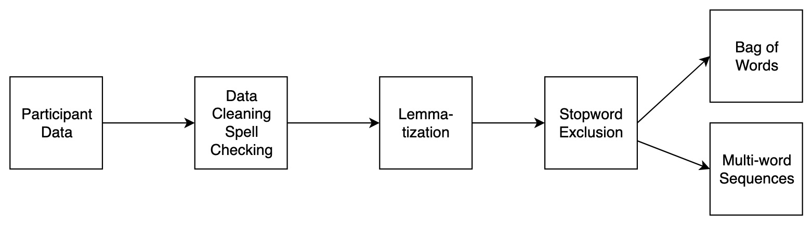

```{r setup, include = FALSE}
knitr::opts_chunk$set(cache = TRUE)
library("papaja")
library(kableExtra)
library(cowplot)
library(ggplot2)
cleanup = theme(panel.grid.major = element_blank(), 
              panel.grid.minor = element_blank(), 
              panel.background = element_blank(), 
              axis.line.x = element_line(colour = "black"), 
              axis.line.y = element_line(colour = "black"),
              legend.key = element_rect(fill = "white"),
              text = element_text(size = 12),
              axis.text.x = element_text(size = 12),
              axis.text.y = element_text(size = 12))

def.chunk.hook <- knitr::knit_hooks$get("chunk")
knitr::knit_hooks$set(chunk = function(x, options) {
  x <- def.chunk.hook(x, options)
  ifelse(options$size != "normalsize", paste0("\\", options$size,"\n\n", x, "\n\n \\normalsize"), x)
})
```

Semantic properties are assumed to be, entirely or in part, the building blocks of semantic representation - the knowledge we have of the world - by a variety of theories [e.g., @Collins1969; @Jackendoff2002; @Jackendoff1992; @Minsky1975; @Norman1975; @Saffran1999; @Smith1981] and computational models [@Caramazza1988; @Farah1991; @Humphreys2001]. Within this perspective, the meaning of a concept is conceived as a distributed pattern of semantic properties, which convey multiple types of information [@Cree2003; @Plaut2002; @Rogers2004]. For example, the concept HORSE can be described by encyclopedic (<*is a mammal*>), visual (<*is furry*>, <*has legs*>, <*has a tail*>, <*has a mane*>), functional (<*used for racing*>), and motor (<*gallops*>) information. Given the relevance of semantic properties in shaping theories of semantic representation, researchers have recognized the value of collecting semantic property production norms. Typically, in the property generation task, participants are presented with a set of concepts and are asked to list the properties they think are characteristic for each concept meaning. Generally, in this task, the concepts are called *cues*, and the responses to the cue are called *features*^[Throughout this article, features will be distinguished from cues using angular brackets and italic font.]. While the method is most frequently used to study the semantic representations of concrete concepts and categories [@Rosch1975; @McRae2005; @Smith1974], it has also been used for other types of concepts, corresponding to verbs [@Vinson2008], events, and abstract concepts [@Lebani2016; @KatjaWiemer-Hastings2005; @Recchia2012].

On the one hand, many studies adopted the property generation task itself to make inferences about word meaning and its computation [@Recchia2012; @KatjaWiemer-Hastings2005; @Wu2009; @Santos2011]. On the other hand, researchers employed the property listing task in order to provide other researchers with a tool of standardized word stimuli and relative semantic measures. Indeed, based on data obtained from the property production task, it is then possible to calculate numerous measures and distributional statistics both at the feature and the concept level. For example, these feature data can be used to determine the semantic similarity/distance between concepts, often by calculating the feature overlap or number of shared features between concepts [@Buchanan2019; @McRae2005; @Vigliocco2004; @Montefinese2015; @Montefinese2018], or how different types [@Kremer2011a; @DanieleZannino2006] and dimensions of feature informativeness, such as, distinctiveness [@Duarte2009; @Garrard2001], cue validity [@Rosch1975], relevance [@Sartori2004], semantic richness [@Pexman2008], and significance [@Montefinese2014] are distributed across concepts. 

Efficient ways to collect data online have boosted the availability of large feature listing data sets. These semantic feature norms are now available across different languages: Dutch [@Ruts2004; @DeDeyne2008d], English [@Buchanan2013; @Buchanan2019; @Devereux2014; @Garrard2001; @McRae2005; @Vinson2008], German [@Kremer2011a], Italian [@Kremer2011a; @Catricala2015; @Montefinese2013; @Zannino2006], Portuguese [@Marques2007a], and Spanish [@Vivas2017] as well as for blind participants [@Lenci2013]. However, these norms vary substantially in the procedure of data collection and their pre-processing, and this does not facilitate performing cross-language comparisons and, thus, making inferences about how semantic representations are generalizable across languages. 

First, there is a lack of agreement in the instructions provided to the participants. Indeed, while some studies use an open-ended verbal feature production [@Buchanan2013; @Buchanan2019; @Montefinese2013; @DeDeyne2008d] where participants can list the features related to the concept with any kind of semantic relation, other studies use a constrained verbal feature production [@Garrard2001; @Devereux2014] where participants were instructed to use specific semantic relations between cue concept and features, such as, for example, <*is ...*>, <*has ...*>, <*does ...*>, <*made of ...*>, and so forth. Moreover, authors could instruct the participants to produce a single word as a feature instead of a multiple-word description. This latter case could also determine a problem on subsequent coding steps that affect the identification of pieces of information. For example, if the participant listed the feature <*has four wheels*> for the concept CAR, there is no consensus if this feature should be divided into <*has wheels*> and <*has four wheels*>, under the assumption that the participant provided two pieces of information, or rather if it should be considered as a unique feature. Second, some authors gave a time limit to provide the features descriptions [@Kremer2011a; @Lenci2013; @Marques2007a] or a limited number of features to be listed [@DeDeyne2008d], with a possible influence on a number of feature-based measures (e.g., semantic richness or distinctiveness).

Because the feature listing task is a verbal task and language is very productive (i.e., the same feature can be expressed in many different ways), few features will be listed in exactly the same way across participants. To be able to derive reliable quantitative measures, nearly all studies specify a series of pre-processing steps to group verbal utterances about the same underlying conceptual property together. The main problem is that there is no agreement about how to code/pre-process data derived from the feature listing task. Recoding features is sometimes done in manually [@McRae2005] whereas others use semi-automatic procedures, especially for larger datasets [@Buchanan2019]. Further points of debate are related to the inclusion/exclusion of certain types of responses. For example, unlike previous semantic norms [@Vivas2017; @McRae2005; @Montefinese2013], @Buchanan2019 included idiosyncratic features (features produced only by one or a few number of participants) if they were in the top listed features, ambiguous words (words with multiple meanings), and created a special coding for affixes of the root words. Moreover, they discarded stop words, such as, the, an, of, and synonyms were treated as different entries. 

While hand-coding features leads to features that concise, easily interpretable, and highly predictive of semantic behavior, the increasing scale of recent studies and more powerful natural language processing techniques make automatic procedures an attractive alternative for assistance in processing language data. Moreover, building standard automatic procedures to process feature-listing data would not only add transparency to the process but would also reduce human errors and allow a generalization of the data across languages. For the first time, in this study, we propose an automatic procedure to code the raw feature data derived from a semantic feature listing task. The next sections provide a tutorial on how raw feature data might be processed to a more compact feature output. The tutorial is written for *R* and is fully documented, such that users can adapt it to their language of choice (https://github.com/doomlab/FLT-Primer). Figure \@ref(fig:flowchart) portrays the proposed set of steps including spell checking, lemmatization, exclusion of stop words, and final processing in a multi-word sequence approach or a bag of words approach. After detailing these steps, the final data form will evaluated and compared to previous norms to determine the usefulness of this approach.

```{r flowchart, echo=FALSE, fig.cap ="Flow chart illustrating how feature lists are recoded to obtain a standard feature format.", fig.height=3, fig.width=4}

```

## Materials and Data Format

You can load the entire set of libraries for this tutorial as shown below using `dependencies.R` found online^[A `packrat` project compilation is available on GitHub for reproducibility [@Ushey2018], and this manuscript was written in Rmarkdown with `papaja` [@Aust2017].]. 

```{r libraries, echo = T, size="scriptsize", messages = F}
library(here)
library(dplyr)
#Spelling
library(hunspell)
library(tidytext)
library(stringi)
#Lemmatization
library(koRpus) 
library(koRpus.lang.en)
library(tokenizers)
#Stopwords
library(stopwords)
```

The data can then be imported with `importData.R`. Additionally, the answers from participants may need to be normalized into lowercase for consistency. 

```{r importdata, echo = T, size="scriptsize", messages = F}
# Importing the raw feature lists
X <- read.csv("../raw_data/tidy_words.csv", stringsAsFactors = F)
## Lower case to normalize
X$feature_response <- tolower(X$feature_response)
```

```{r data, include = F}
X_master <- read.csv("../raw_data/tidy_words.csv", stringsAsFactors = F)
## Importing the information from Buchanan 2019 to get types of words
b_data <- read.csv("../raw_data/final words 2017.csv", stringsAsFactors = F)

## Figure out the POS for our list
b_map <- b_data[ , c("cue", "pos_cue")]
b_map <- unique(b_map)
b_map <- b_map[b_map$cue %in% X$cue , ]
b_table <- table(b_map$pos_cue)

## Importing concreteness ratings
concrete <- read.delim("../raw_data/concrete.txt")

## Merging rating
colnames(b_map)[1] = "Word"
b_map_merge <- merge(b_map, concrete, by = c("Word"))

b_map_M <- tapply(b_map_merge$Conc.M, b_map_merge$pos_cue, mean, na.rm = T)
b_map_SD <- tapply(b_map_merge$Conc.M, b_map_merge$pos_cue, sd, na.rm = T)
```

```{r tab1, echo = F, results = 'asis'}
kable(x = head(X), format = "latex", 
          booktabs = T, row.names = F, 
          caption = "Example of Data Formatted for Tidy Data",
          col.names = c("Cue", "Participant Answer")) %>% 
  column_spec(2, width = "30em")
```

The data for this tutorial includes `r prettyNum(nrow(X), big.mark = ",")` unique concept-feature responses for `r length(unique(X$cue))` concepts from @Buchanan2019. The concepts were taken from @McRae2005, @Vinson2008, and @Bruni2014. The concepts include `r b_table["noun"]` nouns, `r b_table["verb"]` verbs, and `r b_table["adjective"]` adjectives.  The concepts were both abstract and concrete, and to describe the concepts, the concreteness ratings collected by @Brysbaert2014 can be used. In their study, they asked participants to rate words on a scale ranging from 1 - abstract (language-based) - to 5 - concrete (experience-based) - concepts. Nouns were rated as most concrete: *M* = `r printnum(b_map_M["noun"])` (*SD* = `r printnum(b_map_SD["noun"])`), followed by adjectives: *M* = `r printnum(b_map_M["adjective"])` (*SD* = `r printnum(b_map_SD["adjective"])`), and verbs: *M* = `r printnum(b_map_M["verb"])` (*SD* = `r printnum(b_map_SD["verb"])`). The feature listing data consist of a text file where concept-feature observation is a row and each column is a variable. An example of these raw data are shown in Table \@ref(tab:tab1), where the `cue` column is the cue, and the `feature_response` column denotes a single participant's response. The original data can be found at https://osf.io/cjyzw/. 

The data was collected using the instructions provided by @McRae2005, however, in contrast to the suggestions for consistency detailed above [@Devereux2014], each participant was simply given a large text box to include their answer. Each answer includes multiple embedded features, and the tutorial proceeds to demonstrate potential processing addressing the additional challenges in unstructured data of this nature. Figure \@ref(fig:flowchart) portrays the suggested data processing steps. With structured data entry for participants (e.g., asking participants to type one feature on each line), the multi-word sequence step would be implemented within the data collection design, rather than post-processing. This tutorial presents the more difficult scenario to be applicable to more data collection methods. 

## Spelling 

The first step (see Figure \@ref(fig:flowchart)) in processing the features consists of identifying and replacing spelling mistakes. Spell checking can be automated with the `hunspell` package in *R* [@Ooms2018] using `spellCheck.R`. Each `feature_response` can be checked for misspellings across an entire column of answers, which is in the `X` dataset. Because participants were recruited in the United States, we used the American English dictionary. The `hunspell` vignettes provide details on how to import your own dictionary for non-English languages. The choice of dictionary should also normalize between multiple variants of the same language, for example, the `"en_GB"` would convert to British English spellings. 

```{r check_spelling, echo = T, size="scriptsize", messages = F}
# Extract a list of words
tokens <- unnest_tokens(tbl = X, output = token, input = feature_response)
wordlist <- unique(tokens$token)
# Spell check the words
spelling.errors <- hunspell(wordlist)
spelling.errors <- unique(unlist(spelling.errors))
spelling.sugg <- hunspell_suggest(spelling.errors, dict = dictionary("en_US"))
```

The result from the `hunspell()` function is a list object of spelling errors for each row of data. For example, when responding to `r toupper(X$cue[173])`, a participant wrote <*fruit, grocery store, orchard, red, green, yelloe, good with peanut butter, good with caramell*>, and the spelling errors were denoted as <*yelloe*> and <*caramell*>. After checking for errors, the `hunspell_suggest()` function was used to determine the most likely replacement for each error. For <*yelloe*>, both <*yellow*> and <*yell*> were suggested, and <*caramel*> and <*camel*> were suggested for <*caramell*>. 

Answers are provided in the most probable order, therefore, the first suggestion is selected as the correct answer. These answers are compiled into a spelling dictionary, which is saved for reproducibility and can be used to manually check the validity of the suggestions in a final (optional) step. In addition to the hunspell dictionary, an auxiliary dictionary with pre-coded error responses and corrections could also be added at this stage to catch any false positives by adding entries to the `spelling.dict`. For example, by examining `spelling.dict`, we found entries that would need to be corrected: *tast* became *tacit*, *frends* became *fends*, and *musles* became *mules*. Since the spelling dictionary is saved this will facilitate the additional step of manually examining the output for incorrect suggestions and to add their own corrections. This file could then be reloaded and used in the step below to provide adjusted spelling corrections. Other paid alternatives, such as Microsoft's Bing Spell Check, can be a useful avenue for datasets that may contain brand names (i.e, *apple* versus *Apple*) or slang terms and provides context sensitive corrections (e.g., keeping *Apple* as a response to computer, but not as a response to green).

```{r replace_spell, echo = T, size="scriptsize", messages = F}
# Pick the first suggestion
spelling.sugg <- unlist(lapply(spelling.sugg, function(x) x[1]))
spelling.dict <- as.data.frame(cbind(spelling.errors,spelling.sugg))
spelling.dict$spelling.pattern <- paste0("\\b", spelling.dict$spelling.errors, "\\b")
# Write out spelling dictionary
write.csv(x = spelling.dict, file = "../output_data/spelling.dict.csv", 
          fileEncoding = "utf8", row.names = F)
```

As noted, data was collected with a large text box, allowing participants to list multiple features to the target cue. Participants often used extra spacing, tabs or other punctuation to denote separate answers to the cue. The `unnest_tokens()` function from `tidytext` can be used to split their answers into separate response lines and `trimws()` to remove all extra white spaces [@DeQueiroz2019].

```{r check_spelling2, echo = T, size="scriptsize", messages = F}
# Parse features
tokens <- unnest_tokens(tbl = X, output = token, 
                        input = feature_response, token = stringr::str_split, 
                        pattern = "  |\\, |\\.|\\,|\\;")
tokens$token <- trimws(tokens$token, 
                       which = c("both", "left", "right"), 
                       whitespace = "[ \t\r\n]")
```

To finalize our data cleaning, we can remove blank lines, and use `stri_replace_all_regex()` is used to replace the spelling errors with their corrections from the `stringi` package [@Gagolewski2019]. If the `spelling.dict` output file was manually edited, it can be (re)loaded here with `read.csv` to update with the adjusted spelling corrections^[For transparency, the updated csv file should be renamed, which also practically keeps one from overwriting their adjustments if they rerun their code. The csv should be loaded as `spelling.dict` to continue with the code below.]. The spell checked dataframe is then output to a comma delimited file to preserve each workflow step. 

```{r check_spelling3, echo = T, size="scriptsize", messages = F}
# Remove empty features
tokens <- tokens[!tokens$token =="", ]
tokens$corrected <- stri_replace_all_regex(str = tokens$token,
                                          pattern = spelling.dict$spelling.pattern,
                                          replacement = spelling.dict$spelling.sugg,
                                          vectorize_all = FALSE)
# Rename columns
tokens <- tokens %>% 
  rename(feature = corrected) %>% 
  select(cue, feature)
# Write processed file
write.csv(x = tokens,file = "../output_data/spellchecked.features.csv",
          fileEncoding = "utf8",row.names = F)
```

## Lemmatization

The next step groups different word forms that share the same lemma. The process of lemmatizing words uses a trained dictionary to convert all tokens part of a lexeme set (i.e., all words forms that have the same meaning, *am, are, is*) to a common lemma (i.e., *be*)^[We mainly focus on lemmatization and do not proceed stemming the word because it introduces additional ambiguity. More specifically, stemming involves processing words using heuristics to remove affixes or inflections, such as *ing* or *s*. The stem or root word may not reflect an actual word in the language, as simply removing an affix does not necessarily produce the lemma. For example, in response to AIRPLANE, <*flying*> can be easily converted to <*fly*> by removing the *ing* inflection. However, this same heuristic converts the feature <*wings*> into <*w*> after removing both the *s* for a plural marker and the *ing* participle marker.]. Lemmatization is performed using the `TreeTagger` program [@Schmid1994] and implemented through the `koRpus` package in *R* [@Michalke2018]. TreeTagger is a trained tagger designed to annotate part of speech and lemma information in text, and parameter files are available for multiple languages. We will create a unique set of tokenized words to lemmatize to speed computation, as shown in `lemmatization.R`. 

```{r lemma, echo = T, size="scriptsize", messages = F}
# Open the spell checked data
X <- read.csv("../output_data/spellchecked.features.csv", stringsAsFactors = F)
# Extract the list of updated tokens
tokens <- unnest_tokens(tbl = X, output = word, input = feature)
cuelist <- unique(tokens$cue)
```

The `treetag()` function calls the installation of TreeTagger to provide part of speech tags and lemmas for each token. Importantly, the `path` option should be the directory of the TreeTagger installation. 

```{r lemma_treetag, echo = T, size="scriptsize"}
# Create a dataframe for lemmas
tokens.tagged <- data.frame(doc_id=character(),
                          token=character(),
                          wclass=character(),
                          lemma=character(),
                          stringsAsFactors=FALSE)
# Loop over cues and create lemmas + POS tags 
for (i in 1:length(cuelist)){
  temp.tag <- suppressWarnings(
    suppressMessages(
      treetag(c(X$feature[X$cue == cuelist[i]], "NULL"),
              treetagger="manual", format="obj",
              TT.tknz=FALSE, lang="en", doc_id = cuelist[i],
              # These parameters are based on your computer
              TT.options=list(path="~/TreeTagger", preset="en"))))
  temp.tag <- temp.tag@TT.res %>% 
    mutate_if(is.factor, as.character)
  tokens.tagged <- tokens.tagged %>% 
    bind_rows(temp.tag %>% 
                select(doc_id, token, wclass, lemma))
  }
```

This function returns a tagged corpus object, which can be converted into a dataframe of the token-lemma information. TreeTagger will return `<unknown>` for unknown values and `@card@` for numbers, and these values were replaced with the original token. Table \@ref(tab:tab2) portrays example results from TreeTagger.  

```{r lemma_remove, echo = T, size="scriptsize"}
tokens.tagged <- tokens.tagged %>% 
  rename(cue = doc_id, feature = token, pos = wclass)
# Clean up unknown lookups
tokens.tagged$lemma[tokens.tagged$lemma == "<unknown>"] <- tokens.tagged$feature[tokens.tagged$lemma == "<unknown>"]
tokens.tagged$lemma[tokens.tagged$lemma == "@card@"] <- tokens.tagged$feature[tokens.tagged$lemma == "@card@"]
tokens.tagged$lemma <- tolower(tokens.tagged$lemma)
# Write processed file
write.csv(x = tokens.tagged, file = "../output_data/lemmatized.features.csv", 
          fileEncoding = "utf8", row.names = F)
```

```{r tab2, echo = F, results = 'asis'}
kable(tokens.tagged[8:13 , ], "latex", booktabs = T, row.names = F, 
      caption = "Lemma and Part of Speech (POS) Information from TreeTagger", 
      col.names = c("Cue", "Feature", "POS", "Lemma"))
```

## Stopwords

As shown in Figure \@ref(fig:flowchart), the next stage of processing would be to exclude stopwords, such as *the, of, but*. The `stopwords` package [@Benoit2017] includes a list of stopwords for more than 50 languages. At this stage, the `feature` (original tokens, not lemmatized) or `lemma` (lemmatized tokens) column can be used depending on researcher selection. This code is included in `stopWordRemoval.R`. Within the `filter` command, we have excluded all lemmas in the stopword list provided by the `stopwords` library. Using `stopwords(language = "en", source = "snowball")`, one can view the stopword list and edit it for their own needs. 

``` {r stop_words, echo = T, size="scriptsize"}
# Open the lemmatized data
X <- read.csv("../output_data/lemmatized.features.csv", stringsAsFactors = F)
# Remove punctuation and stopwords from lemmas
X$lemma <- gsub("\\-", " ", X$lemma)
X$lemma <- gsub("^$|\002", NA, trimws(X$lemma))
X.nostop <- X %>% 
  filter(!grepl("[[:punct:]]", lemma)) %>% 
  filter(!lemma %in% stopwords(language = "en", source = "snowball")) %>% 
  filter(!is.na(lemma)) 
# Write processed file
write.csv(x = X.nostop, file = "../output_data/nostop.lemmas.csv", 
          fileEncoding = "utf8", row.names = F)
```

## Multi-word Sequences

Multi-word sequences are often coded to mimic a @Collins1969 semantic network, where words are nodes and edges are labelled with relations such as "is-a" or "has-a". Some instructions specify the use of specific relation types [@Garrard2001; @Devereux2014], in which case pre-encoded the following step can be omitted. A potential solution for processing unstructured data involves identifying patterns that mimic "is-a" and "has-a" strings. Examples of such an approach is the Strudel model [@Baroni2010] in which meaningful relations are grouped together using a small set of highly specific regular expressions. An examination of the coding in @McRae2005 and @Devereux2014 indicates that the feature tags are often adverb-adjective (<*usually-sweet*>), verb-noun (<*made-wood*>), or verb-adjective-noun (<*requires-lighting-source*>) sequences. Using TreeTagger on each concept’s answer set, we can obtain the parts of speech in context for each lemma. With `dplyr` [@Wickham2019], new columns are added to tagged data to show all bigram and trigram sequences. All adverb-adjective, verb-noun, and verb-adjective-noun combinations are selected, and any words not part of these multi-word sequences are treated as unigrams. Finally, the `count()` function is used to tabulate the final count of n-grams and their frequency (`multiwordSequences.R`).

```{r multi_words, echo = T, size="scriptsize", message = F}
# Open the no stop words data
X <- read.csv("../output_data/nostop.lemmas.csv", stringsAsFactors = F)
# Combine lemmas and POS
X <- X %>% 
  mutate(two.words = paste(lemma, lead(lemma), sep = " "), 
         three.words = paste(lemma, lead(lemma), 
                             lead(lemma, n = 2L), sep = " "), 
         two.words.pos = paste(pos, lead(pos), sep = "."),
         three.words.pos = paste(pos, lead(pos), 
                                 lead(pos, n = 2L), sep = "."))
# Patterns
adverb.adj <- grep("\\badverb.adj", X$two.words.pos)
verb.nouns <- grep("\\bverb.noun", X$two.words.pos)
verb.adj.nouns <- grep("\\bverb.adjective.noun", X$three.words.pos)
# Use combined and left over lemmas
X$combined.lemmas <- NA
X$combined.lemmas[c(adverb.adj, verb.nouns)] <- X$two.words[c(adverb.adj,verb.nouns)]
X$combined.lemmas[verb.adj.nouns] <- X$three.words[verb.adj.nouns]
X$combined.lemmas[-c(verb.nouns, verb.nouns+1, verb.adj.nouns, 
                     verb.adj.nouns+1, verb.adj.nouns+2)] <- X$lemma[-c(verb.nouns, verb.nouns+1,
                                                                        verb.adj.nouns, verb.adj.nouns+1, 
                                                                        verb.adj.nouns+2)]
#Create cue-lemma frequency
multi.words <- X %>% 
  filter(!is.na(combined.lemmas)) %>% 
  group_by(cue) %>% 
  count(combined.lemmas) 
# Write processed file
write.csv(x = multi.words, file = "../output_data/multi.nostop.lemmas.csv",
          fileEncoding = "utf8", row.names = F)
```

This procedure produces appropriate output, such as FINGERS <*have fingernails*> and COUCHES <*have cushions*>. One obvious limitation is the potential necessity to match this coding system to previous codes, which were predominately hand processed. Further, many similar phrases, such as the ones for ZEBRA shown below may require flexible regular expressions to ensure that the different codings for <*is a horse*> are all combined together, as shown in Table \@ref(tab:tab4).

```{r tab4, echo = F, results = 'asis'}
zebra <- multi.words[ grep("horse", multi.words$combined.lemmas) , ]
zebra <- zebra[zebra$cue == "zebra", ]

kable(zebra, "latex", booktabs = T, row.names = F, 
      caption = "Multi-Word Sequence Examples for Zebra", 
      col.names = c("Cue", "Combined Lemmas", "N")) 
```

## Bag of Words 

To be able to evaluate the role of identifying multi-word sequences, we now describe an approach where this information is not retained. This bag of words approach simply treats each token as a separate feature to be tabulated for analysis. After stemming and lemmatization, the data can be processed as single word tokens into a table of frequencies for each cue word. The resulting dataframe is each cue-feature combination with a total for each feature from `bagOfWords.R`. Table \@ref(tab:tab5) shows the top ten most frequent responses to ZEBRA given the bag of words approach.

```{r bag_words, echo = T, size="scriptsize", message = F}
# Open the no stop words data
X <- read.csv("../output_data/nostop.lemmas.csv", stringsAsFactors = F)
# Create cue-lemma frequency 
bag.words <- X %>% 
  group_by(cue) %>% 
  count(lemma) 
# Write processed file
write.csv(x = bag.words, file = "../output_data/bag.nostop.lemmas.csv",
          fileEncoding = "utf8", row.names = F)
```

```{r tab5, echo = F, results = 'asis'}
zebra <- bag.words[ bag.words$cue == "zebra" , ]
zebra <- zebra[order(zebra$n, decreasing = T), ]

kable(zebra[1:10, ], "latex", booktabs = T, row.names = F, 
      caption = "Bag of Words Examples for Zebra",
      col.names = c("Cue", "Lemma", "N")) 
```

## Descriptive Statistics

The finalized data now represents a processed set of cue-feature combinations with their frequencies for analysis. The data from @Buchanan2019 was collected over multiple years with multiple sample sizes. The sample size for each cue was then merged with the finalized cue-feature information to control for differences in potential maximum frequency. Table \@ref(tab:tab6) includes descriptive statistics for the processed cue-feature set. 

### Number of response types

First, the number of cue-feature combinations was calculated by taking the average number of cue-feature listings for each cue. Therefore, the total number of features listed for ZEBRA might be 100, while APPLE might be 45, and these values were averaged. More cue-feature combinations are listed for the multi-word approach, due to differences in combinations for some overlapping features as shown in Table \@ref(tab:tab4). The large standard deviation for both approaches indicates that cues have a wide range of possible features listed. For example for the cue ZEBRA, we find a total of `r nrow(bag.words[bag.words$cue == "zebra", ])` features, whereas for APPLE we find `r nrow(bag.words[bag.words$cue == "apple", ])` features. We expect that the number of different response tokens is a function of the number of times a cue was presented in the study. To investigate this relation, we calculated the correlation provided represents the relation between sample size for a cue and the number of features listed for that cue. These values are high and positive, indicating that the number of unique features increases with each participant. 

### Idiosyncratic responses

Potentially, many of the cue-feature combinations could be considered idiosyncratic. The next row of the table denotes the average number of cue-feature responses listed by less than 10% of the participants. This percent of responses is somewhat arbitrary, as each researcher has determined where the optimal criterion should be. For example, @McRae2005 used 16% or 5/30 participants as a minimum standard, and @Buchanan2019 recently used a similar criteria. Many cue-features are generated by a small number of participants, indicating that these are potentially idiosyncratic or part of long tailed distribution of feature responses with many low frequency features. The advantage to the suggested data processing pipeline and code provided here is the ability of each researcher to determine how many low-frequency features should be included.

### Response strength

The next two lines of Table \@ref(tab:tab6) indicate cue-feature combination frequencies, such as the number of times ZEBRA <*stripes*> or APPLE <*red*> were listed by participants. The percent of responses is the frequency divided by sample size for each cue, to normalize over different sample sizes present in the data. These average frequency/percent can be seen as a measure of response strength and were calculated for each cue, and then averaged over all cues. The correlation represents the average response strength for each cue related to the sample size for that cue. These frequencies are low, matching the results for a large number of idiosyncratic responses. The correlation between frequency of response and sample size is positive, indicating that larger sample sizes produce items with larger frequencies.

Additionally, the correlation between response strength and sample size is negative, suggesting that larger sample sizes are often paired with more items with smaller response strengths. Figure \@ref(fig:correlation-fig) displays the correlations for the average cue-frequency responses and the response strength by sample size. It appears that the relationship between sample size and percent is likely curvilinear, rather than linear. The size of the points indicates the variability (standard deviation of each cue word's average frequency or percent). Variability appears to increase linearly with sample size for average frequency, however, it is somewhat mixed for average percent. These results may imply a necessity to discuss common sample sizes for data collection (*ns* ~ 30) to determine the optimal sample size for an appropriate body of data for each cue word. 

```{r withstopwords, echo = F, include = F}
X <- read.csv("../output_data/lemmatized.features.csv", stringsAsFactors = F)
# Remove punctuation from lemmas
X$lemma <- gsub("\\-", " ", X$lemma)
X$lemma <- gsub("^$|\002", NA, trimws(X$lemma))
X.nopunct <- X %>% 
  filter(!grepl("[[:punct:]]", lemma)) %>% 
  #filter(!lemma %in% stopwords(language = "en", source = "snowball")) %>% 
  filter(!is.na(lemma)) 

##multiwords

# Combine lemmas and POS
X.multi <- X.nopunct %>% 
  mutate(two.words = paste(lemma, lead(lemma), sep = " "), 
         three.words = paste(lemma, lead(lemma), 
                             lead(lemma, n = 2L), sep = " "), 
         two.words.pos = paste(pos, lead(pos), sep = "."),
         three.words.pos = paste(pos, lead(pos), 
                                 lead(pos, n = 2L), sep = "."))
# Patterns
adverb.adj <- grep("\\badverb.adj", X.multi$two.words.pos)
verb.nouns <- grep("\\bverb.noun", X.multi$two.words.pos)
verb.adj.nouns <- grep("\\bverb.adjective.noun", X.multi$three.words.pos)
# Use combined and left over lemmas
X.multi$combined.lemmas <- NA
X.multi$combined.lemmas[c(adverb.adj, verb.nouns)] <- X.multi$two.words[c(adverb.adj,verb.nouns)]
X.multi$combined.lemmas[verb.adj.nouns] <- X.multi$three.words[verb.adj.nouns]
X.multi$combined.lemmas[-c(verb.nouns, verb.nouns+1, verb.adj.nouns, 
                     verb.adj.nouns+1, verb.adj.nouns+2)] <- X.multi$lemma[-c(verb.nouns, verb.nouns+1,
                                                                        verb.adj.nouns, verb.adj.nouns+1, 
                                                                        verb.adj.nouns+2)]
#Create cue-lemma frequency
multi.words.withstop <- X.multi %>% 
  filter(!is.na(combined.lemmas)) %>% 
  group_by(cue) %>% 
  count(combined.lemmas) 

# Create cue-lemma frequency 
bag.words.withstop <- X.nopunct %>% 
  group_by(cue) %>% 
  count(lemma) 
```

```{r desc_stats, echo = F, include = F}
sample_sizes <- as.data.frame(tapply(X_master$cue, X_master$cue, length))
sample_sizes$Word <- rownames(sample_sizes)
colnames(sample_sizes) <- c("Sample_Size", "cue")

multi_words_nostop <- merge(multi.words, sample_sizes, by = "cue")
bag_words_nostop <- merge(bag.words, sample_sizes, by = "cue")

## For later showing that removing stop helps
multi_words <- merge(multi.words.withstop, sample_sizes, by = "cue")
bag_words <- merge(bag.words.withstop, sample_sizes, by = "cue")

## redo column names to match code below
columnnames <- c("Word", "Feature", "Frequency", "Sample_Size")
colnames(multi_words_nostop) <- colnames(bag_words_nostop) <- colnames(multi_words) <- colnames(bag_words) <- columnnames

#number of features
no_feat_m <- tapply(multi_words_nostop$Frequency, multi_words_nostop$Word, length)
no_feat_b <- tapply(bag_words_nostop$Frequency, bag_words_nostop$Word, length)

#correlations
cor(no_feat_b, no_feat_m)
cor(no_feat_m, sample_sizes$Sample_Size)
cor(no_feat_b, sample_sizes$Sample_Size)

#number of responses
no_resp_mM <- tapply(multi_words_nostop$Frequency, multi_words_nostop$Word, mean)
no_resp_bM <- tapply(bag_words_nostop$Frequency, bag_words_nostop$Word, mean)
no_resp_mSD <- tapply(multi_words_nostop$Frequency, multi_words_nostop$Word, sd)
no_resp_bSD <- tapply(bag_words_nostop$Frequency, bag_words_nostop$Word, sd)

multi_words_nostop$Percent <- multi_words_nostop$Frequency/multi_words_nostop$Sample_Size*100
bag_words_nostop$Percent <- bag_words_nostop$Frequency/bag_words_nostop$Sample_Size*100

multi_words$Percent <- multi_words$Frequency/multi_words$Sample_Size*100
bag_words$Percent <- bag_words$Frequency/bag_words$Sample_Size*100

#number of responses proportionate to sample size
per_resp_mM <- tapply(multi_words_nostop$Percent, multi_words_nostop$Word, mean)
per_resp_bM <- tapply(bag_words_nostop$Percent, bag_words_nostop$Word, mean)
per_resp_mSD <- tapply(multi_words_nostop$Percent, multi_words_nostop$Word, sd)
per_resp_bSD <- tapply(bag_words_nostop$Percent, bag_words_nostop$Word, sd)

#correlations
cor(no_resp_mM, no_resp_bM)
cor(no_resp_mM, sample_sizes$Sample_Size)
cor(no_resp_bM, sample_sizes$Sample_Size)

#number of small features
no_smallfeat_m <- tapply(multi_words_nostop$Percent[multi_words_nostop$Percent <=10], multi_words_nostop$Word[multi_words_nostop$Percent <=10], length)
no_smallfeat_b <- tapply(bag_words_nostop$Percent[bag_words_nostop$Percent <=10], bag_words_nostop$Word[bag_words_nostop$Percent <=10], length)
```

```{r tab6, echo = F, results = 'asis'}
tableprint <- matrix(NA, nrow = 4, ncol = 7)

colnames(tableprint) <- c("Stat", "M_m", "SD_m", "r_m", 
                          "M_b", "SD_b", "r_b")

tableprint <- as.data.frame(tableprint)
#number of cue-features
tableprint[1, ] <- c("Number of Cue-Features", 
                     mean(no_feat_m), sd(no_feat_m), cor(no_feat_m, sample_sizes$Sample_Size), 
                     mean(no_feat_b), sd(no_feat_b), cor(no_feat_b, sample_sizes$Sample_Size))

#avg small features
tableprint[2, ] <- c("Frequency of Idiosyncratic Response", 
                     mean(no_smallfeat_m), sd(no_smallfeat_m), 
                     cor(no_smallfeat_m, sample_sizes$Sample_Size),
                     mean(no_smallfeat_b), sd(no_smallfeat_b),
                     cor(no_smallfeat_b, sample_sizes$Sample_Size))

#avg no times cue-feature listed
tableprint[3, ] <- c("Frequency of Cue-Feature Response", 
                     mean(no_resp_mM), mean(no_resp_mSD), 
                     cor(no_resp_mM, sample_sizes$Sample_Size),
                     mean(no_resp_bM), mean(no_resp_bSD), 
                     cor(no_resp_bM, sample_sizes$Sample_Size))

#avg percent cue-feature listed
tableprint[4, ] <- c("Percent of Cue-Feature Response", 
                     mean(per_resp_mM), mean(per_resp_mSD), 
                     cor(per_resp_mM, sample_sizes$Sample_Size),
                     mean(per_resp_bM), mean(no_resp_bSD),
                     cor(per_resp_bM, sample_sizes$Sample_Size))

for (i in 2:7){
  if (i == 4 | i == 7){
    
    tableprint[ , i] <- printnum(as.numeric(tableprint[ , i]), gt1 = F)
    
  } else {tableprint[ , i] <- printnum(as.numeric(tableprint[ , i]))}
}

kable(tableprint, "latex", booktabs = T, row.names = F,
      escape = F, 
      col.names = c("Statistics", "$Mean$", "$SD$", "$r$", 
                          "$Mean$", "$SD$", "$r$"), 
      caption = "Descriptive Statistics for Multi-word Sequences and Bag-of-words Approaches") %>%  
  add_header_above(c(" " = 1, "Multi-Word Sequences" = 3, "Bag of Words" = 3)) %>% 
  add_footnote("$Note$. The correlation (r) represents the relation between frequency of response and sample size.", notation="none", escape = F)
```

```{r correlation-fig, echo = F, fig.height=6, fig.width=8, fig.cap="Correlation of sample size with the average cue-feature frequency (left) and percent (right) of response for each cue for both processing approaches. Each point represents a cue word, and the size of the point indicates the variability of the average frequency (left) or percent (right)."}

p1 <- ggplot(data = NULL, aes(no_resp_bM, sample_sizes$Sample_Size)) +
  geom_point(alpha = .25, size = no_resp_bSD) +
  xlab("Average Frequency Cue-Feature Response") +
  ylab("Cue Sample Size") + 
  labs(title="Bag of Words") +
  cleanup +
  coord_cartesian(xlim = c(1,10), ylim = c(0, 450)) +
  scale_x_continuous(breaks = c(2,4,6,8,10))

p2 <- ggplot(data = NULL, aes(per_resp_bM, sample_sizes$Sample_Size)) +
  geom_point(alpha = .25, size = per_resp_bSD) +
  xlab("Average Percent Cue-Feature Response") +
  ylab("Cue Sample Size") + 
  labs(title="Bag of Words") +
  cleanup +
  coord_cartesian(xlim = c(1,10), ylim = c(0, 450)) +
  scale_x_continuous(breaks = c(2,4,6,8,10))

p3 <- ggplot(data = NULL, aes(no_resp_mM, sample_sizes$Sample_Size)) +
  geom_point(alpha = .25, size = no_resp_mSD) +
  xlab("Average Frequency Cue-Feature Response") +
  ylab("Cue Sample Size") + 
  labs(title="Multi-word Sequences") +
  cleanup +
  coord_cartesian(xlim = c(1,10), ylim = c(0, 450)) +
  scale_x_continuous(breaks = c(2,4,6,8,10))

p4 <- ggplot(data = NULL, aes(per_resp_mM, sample_sizes$Sample_Size)) +
  geom_point(alpha = .25, size = per_resp_mSD) +
  xlab("Average Percent Cue-Feature Response") +
  ylab("Cue Sample Size") + 
  labs(title="Multi-word Sequences") +
  cleanup +
  coord_cartesian(xlim = c(1,10), ylim = c(0, 450)) +
  scale_x_continuous(breaks = c(2,4,6,8,10))

prow <- plot_grid(p1, p2, p3, p4, hjust = -1, nrow = 2)
prow
```

## Internal Comparison of Approach

In this section, we show that the bag of words approach approximates the data from @McRae2005, @Vinson2008, and  @Buchanan2019, thus comparing data processed completely through code to datasets that were primarily hand coded. These datasets were recoded in a bag of words approach, and the comparison between all three is provided below. The multi-word sequence approach would be comparable if one or more datasets used the same structured data collection approach or with considerable hand coded rules for feature combinations. The data from open ended responses, such as the @Buchanan2019, could potentially be compared in the demonstrated multi-word sequence approach, if the raw data from other such projects were available. 

```{r compare_b, echo = F, include = F}
library(readxl)
## b data imported earlier 

## Reduce down only to overlap words
b_data <- subset(b_data, cue %in% cuelist)
b_data <- b_data[ , c("where", "cue", "feature", "translated",
                      "frequency_feature", "frequency_translated") ]

library(lsa)

cosine_values <- data.frame(word=cuelist,
                            raw_b=1:length(cuelist), 
                            raw_m=1:length(cuelist),
                            raw_v=1:length(cuelist),
                            translated_b=1:length(cuelist), 
                            translated_m=1:length(cuelist), 
                            translated_v=1:length(cuelist), 
                            stringsAsFactors=FALSE)

cosine_values_wstop <- data.frame(word=cuelist,
                            raw_b=1:length(cuelist), 
                            raw_m=1:length(cuelist),
                            raw_v=1:length(cuelist),
                            translated_b=1:length(cuelist), 
                            translated_m=1:length(cuelist), 
                            translated_v=1:length(cuelist), 
                            stringsAsFactors=FALSE)

for (i in 1:length(cuelist)){
 
  temp_b <- b_data[b_data$cue == cuelist[i] & b_data$where == "b", ]
  temp_m <- b_data[b_data$cue == cuelist[i] & b_data$where == "m", ] 
  temp_v <- b_data[b_data$cue == cuelist[i] & b_data$where == "v", ]
  temp_bag <- bag_words_nostop[bag_words_nostop$Word == cuelist[i], ]
  colnames(temp_bag)[2] = "feature"
  temp_bag_wstop <- bag_words[bag_words$Word == cuelist[i], ]
  colnames(temp_bag_wstop)[2] = "feature"
  
  ## Based on unprocessed data 
  temp_merge_b <- merge(temp_b, temp_bag, by = "feature", all = T)
  temp_merge_m <- merge(temp_m, temp_bag, by = "feature", all = T)
  temp_merge_v <- merge(temp_v, temp_bag, by = "feature", all = T)
  
  temp_merge_b_wstop <- merge(temp_b, temp_bag_wstop, by = "feature", all = T)
  temp_merge_m_wstop <- merge(temp_m, temp_bag_wstop, by = "feature", all = T)
  temp_merge_v_wstop <- merge(temp_v, temp_bag_wstop, by = "feature", all = T)
  
  temp_merge_b[c("frequency_feature", "Frequency")][is.na(temp_merge_b[c("frequency_feature", "Frequency")])] <- 0
  temp_merge_m[c("frequency_feature", "Frequency")][is.na(temp_merge_m[c("frequency_feature", "Frequency")])] <- 0
  temp_merge_v[c("frequency_feature", "Frequency")][is.na(temp_merge_v[c("frequency_feature", "Frequency")])] <- 0
  
    temp_merge_b_wstop[c("frequency_feature", "Frequency")][is.na(temp_merge_b_wstop[c("frequency_feature", "Frequency")])] <- 0
  temp_merge_m_wstop[c("frequency_feature", "Frequency")][is.na(temp_merge_m_wstop[c("frequency_feature", "Frequency")])] <- 0
  temp_merge_v_wstop[c("frequency_feature", "Frequency")][is.na(temp_merge_v_wstop[c("frequency_feature", "Frequency")])] <- 0
  
  cosine_values$raw_b[i] <- cosine(temp_merge_b$frequency_feature, temp_merge_b$Frequency)
  cosine_values$raw_m[i] <- cosine(temp_merge_m$frequency_feature, temp_merge_m$Frequency)
  cosine_values$raw_v[i] <- cosine(temp_merge_v$frequency_feature, temp_merge_v$Frequency)
  
    cosine_values_wstop$raw_b[i] <- cosine(temp_merge_b_wstop$frequency_feature, temp_merge_b_wstop$Frequency)
  cosine_values_wstop$raw_m[i] <- cosine(temp_merge_m_wstop$frequency_feature, temp_merge_m_wstop$Frequency)
  cosine_values_wstop$raw_v[i] <- cosine(temp_merge_v_wstop$frequency_feature, temp_merge_v_wstop$Frequency)
  
  ## Based on processed data
  colnames(temp_bag)[2] = "translated"
  temp_merge_b <- merge(temp_b, temp_bag, by = "translated", all = T)
  temp_merge_m <- merge(temp_m, temp_bag, by = "translated", all = T)
  temp_merge_v <- merge(temp_v, temp_bag, by = "translated", all = T)
  
  colnames(temp_bag_wstop)[2] = "translated"
  temp_merge_b_wstop <- merge(temp_b, temp_bag_wstop, by = "translated", all = T)
  temp_merge_m_wstop <- merge(temp_m, temp_bag_wstop, by = "translated", all = T)
  temp_merge_v_wstop <- merge(temp_v, temp_bag_wstop, by = "translated", all = T)
  
  temp_merge_b[c("frequency_translated", "Frequency")][is.na(temp_merge_b[c("frequency_translated", "Frequency")])] <- 0
  temp_merge_m[c("frequency_translated", "Frequency")][is.na(temp_merge_m[c("frequency_translated", "Frequency")])] <- 0
  temp_merge_v[c("frequency_translated", "Frequency")][is.na(temp_merge_v[c("frequency_translated", "Frequency")])] <- 0
  
  temp_merge_b_wstop[c("frequency_translated", "Frequency")][is.na(temp_merge_b_wstop[c("frequency_translated", "Frequency")])] <- 0
  temp_merge_m_wstop[c("frequency_translated", "Frequency")][is.na(temp_merge_m_wstop[c("frequency_translated", "Frequency")])] <- 0
  temp_merge_v_wstop[c("frequency_translated", "Frequency")][is.na(temp_merge_v_wstop[c("frequency_translated", "Frequency")])] <- 0
  
  ### This process creates duplicates
  temp_merge_b <- temp_merge_b[!duplicated(temp_merge_b$translated), ]
  temp_merge_m <- temp_merge_m[!duplicated(temp_merge_m$translated), ]
  temp_merge_v <- temp_merge_v[!duplicated(temp_merge_v$translated), ]
  
  temp_merge_b_wstop <- temp_merge_b_wstop[!duplicated(temp_merge_b_wstop$translated), ]
  temp_merge_m_wstop <- temp_merge_m_wstop[!duplicated(temp_merge_m_wstop$translated), ]
  temp_merge_v_wstop <- temp_merge_v_wstop[!duplicated(temp_merge_v_wstop$translated), ]
  
  cosine_values$translated_b[i] <- cosine(temp_merge_b$frequency_translated, temp_merge_b$Frequency)
  cosine_values$translated_m[i] <- cosine(temp_merge_m$frequency_translated, temp_merge_m$Frequency)
  cosine_values$translated_v[i] <- cosine(temp_merge_v$frequency_translated, temp_merge_v$Frequency)
  
  cosine_values_wstop$translated_b[i] <- cosine(temp_merge_b_wstop$frequency_translated, temp_merge_b_wstop$Frequency)
  cosine_values_wstop$translated_m[i] <- cosine(temp_merge_m_wstop$frequency_translated, temp_merge_m_wstop$Frequency)
  cosine_values_wstop$translated_v[i] <- cosine(temp_merge_v_wstop$frequency_translated, temp_merge_v_wstop$Frequency)
  
  }

cosine_values$raw_m[is.nan(cosine_values$raw_m)] <- NA
cosine_values$raw_v[is.nan(cosine_values$raw_v)] <- NA
cosine_values$translated_m[is.nan(cosine_values$translated_m)] <- NA
cosine_values$translated_v[is.nan(cosine_values$translated_v)] <- NA

cosine_values_wstop$raw_m[is.nan(cosine_values_wstop$raw_m)] <- NA
cosine_values_wstop$raw_v[is.nan(cosine_values_wstop$raw_v)] <- NA
cosine_values_wstop$translated_m[is.nan(cosine_values_wstop$translated_m)] <- NA
cosine_values_wstop$translated_v[is.nan(cosine_values_wstop$translated_v)] <- NA

cosine_M <- apply(cosine_values[ , -1], 2, mean, na.rm = T)
cosine_SD <- apply(cosine_values[ , -1], 2, sd, na.rm = T)
cosine_N <- apply(cosine_values[ , -1], 2, function(x) length(na.omit(x)))

cosine_M_wstop <- apply(cosine_values_wstop[ , -1], 2, mean, na.rm = T)
cosine_SD_wstop <- apply(cosine_values_wstop[ , -1], 2, sd, na.rm = T)
cosine_N_wstop <- apply(cosine_values_wstop[ , -1], 2, function(x) length(na.omit(x)))
```

```{r tab7, echo = F, results = 'asis'}
tableprint <- matrix(NA, nrow = 6, ncol = 5)
colnames(tableprint) <- c("Stat", "Original_S", "Translated_S", "Original", "Translated")
tableprint <- as.data.frame(tableprint)

##b words
tableprint[1 , ] <- c("B Mean", 
                      printnum(cosine_M_wstop['raw_b'], gt1 = F),
                      printnum(cosine_M_wstop['translated_b'], gt1 = F),
                      printnum(cosine_M['raw_b'], gt1 = F),
                      printnum(cosine_M['translated_b'], gt1 = F))

tableprint[2 , ] <- c("B SD", 
                      printnum(cosine_SD_wstop['raw_b'], gt1 = F),
                      printnum(cosine_SD_wstop['translated_b'], gt1 = F),
                      printnum(cosine_SD['raw_b'], gt1 = F),
                      printnum(cosine_SD['translated_b'], gt1 = F))

##m words
tableprint[3 , ] <- c("M Mean", 
                      printnum(cosine_M_wstop['raw_m'], gt1 = F),
                      printnum(cosine_M_wstop['translated_m'], gt1 = F),
                      printnum(cosine_M['raw_m'], gt1 = F),
                      printnum(cosine_M['translated_m'], gt1 = F))

tableprint[4 , ] <- c("M SD", 
                      printnum(cosine_SD_wstop['raw_m'], gt1 = F),
                      printnum(cosine_SD_wstop['translated_m'], gt1 = F),
                      printnum(cosine_SD['raw_m'], gt1 = F),
                      printnum(cosine_SD['translated_m'], gt1 = F))

##v words
tableprint[5 , ] <- c("V Mean", 
                      printnum(cosine_M_wstop['raw_v'], gt1 = F),
                      printnum(cosine_M_wstop['translated_v'], gt1 = F),
                      printnum(cosine_M['raw_v'], gt1 = F),
                      printnum(cosine_M['translated_v'], gt1 = F))

tableprint[6 , ] <- c("V SD", 
                      printnum(cosine_SD_wstop['raw_v'], gt1 = F),
                      printnum(cosine_SD_wstop['translated_v'], gt1 = F),
                      printnum(cosine_SD['raw_v'], gt1 = F),
                      printnum(cosine_SD['translated_v'], gt1 = F))

kable(tableprint, "latex", booktabs = T, row.names = F,
      escape = F, 
      col.names = c("Statistic", "Original", "Translated", "Original", 
                          "Translated"), 
      caption = "Cosine Overlap with Previous Data Collection") %>%  
  add_header_above(c(" " = 1, "With Stopwords" = 2, "No Stopwords" = 2)) %>% 
  add_footnote("$Note$. Translated values are hand coded lemmatization from Buchanan et al. (2019). B: Buchanan et al. (2019), M: McRae et al. (2005), V: Vinson \\& Vigliocco (2008). $N$ values are 226, 61, and 68 respectively. ", notation="none", escape = F) 
```

Cosine similarity is often used as a measure of semantic similarity, indicating the feature overlap between two sets of cue-feature lists. For each concept or cue it provides an estimate of similarity based using a vector consisting of features with magnitudes corresponding to their frequency. The formula is identical to a Pearson product correlation when the vectors are centered to have mean zeros. First, matching feature (i) frequencies of cues A and B are multiplied and then summed, and this value is divided by products of the vector length of A and B for all features:

$$
\frac{\sum \limits_{i=1}^{n} A_i \times B_i}{\sqrt{\sum \limits_{i=1}^{n} A_i^2}\times\sqrt{\sum \limits_{i=1}^{n}B_i^2}}
$$

As all of the frequencies are positive, these values can range from 0 (no overlap) to 1 (perfect overlap). Two cosine values can be derived from the @Buchanan2019 data: the raw cosine, which included all features as listed and the cosine for lemmatized responses. Each cue in the sample data for this project was compared to the corresponding cue in the @Buchanan2019. The example participant responses provided in this tutorial are a subset of the  @Buchanan2019 data, and therefore, if the participant responses were processed in an identical fashion, the cosine values would be nearly 1. Additionally, if the processing detailed here matches the hand coding in the @Buchanan2019, the overlap with the @McRae2005 and @Vinson2008 should be similar. These values were: original feature cosine = .54-.55, and lemmatized^[These results were lemmatized by creating a lookup dictionary from the features listed in the @Buchanan2019 norms.] features = .66-.67. However, all previous datasets have been reduced by eliminating idiosyncratic features at various points, and therefore, we might expect that noise in the data would reduce the average cosine values. 

Table \@ref(tab:tab7) shows the role of using a cut-off for low-frequent or idiosyncratic responses by calculating the cosine values when using varying cut-offs or stopword filtering. On the left, the cosine values with stopwords are provided for both the original feature listed (i.e., no lemmatization) and the lemmatized features. The right side of the table includes the cosine values once stopwords have been removed. The removal of stopwords increases the match between sets indicating how removing these terms can improve prediction. When stop words were excluded, cosine values indicated somewhat comparable set of data, with lower values for McRae et al. (2005) than previous results in the original feature sets. These values portray that the data processed entirely in *R* produces a comparable set of results, albeit with added noise of small frequency features. 

## External Comparison of Approach

```{r compare_men, echo = F}
men_data <- read.table("../raw_data/MEN_dataset_natural_form_full.txt",
                       quote="\"", comment.char="", stringsAsFactors=FALSE)

library(tidyr)
bag_words_spread <- spread(bag_words_nostop[ , -c(4,5)], key = Word, value = Frequency, fill = 0)
bag_words_cosine <- cosine(as.matrix(bag_words_spread[ , -1]))
bag_words_cosine <- as_tibble(bag_words_cosine)
bag_words_cosine$cue <- colnames(bag_words_cosine)
bag_words_cosine <- gather(bag_words_cosine, key = target, 
                           value = cosine, abstract:zebra)
bag_words_cosine$key <- paste(bag_words_cosine$cue, bag_words_cosine$target, sep = " ")

bag_words_spread_wstop <- spread(bag_words[ , -c(4,5)], key = Word, value = Frequency, fill = 0)
bag_words_cosine_wstop <- cosine(as.matrix(bag_words_spread_wstop[ , -1]))
bag_words_cosine_wstop <- as_tibble(bag_words_cosine_wstop)
bag_words_cosine_wstop$cue <- colnames(bag_words_cosine_wstop)
bag_words_cosine_wstop <- gather(bag_words_cosine_wstop, key = target, 
                           value = cosine, abstract:zebra)
bag_words_cosine_wstop$key <- paste(bag_words_cosine_wstop$cue, bag_words_cosine_wstop$target, sep = " ")

men_data$key <- paste(men_data$V1, men_data$V2)
colnames(men_data) <- c("cue", "target", "rating", "key")
  
men_merge = merge(men_data, bag_words_cosine, by = "key")
men_merge_wstop = merge(men_data, bag_words_cosine_wstop, by = "key")

##correlation
cor_MEN <- cor.test(men_merge$rating, men_merge$cosine)
cor_MEN_wstop <- cor.test(men_merge_wstop$rating, men_merge_wstop$cosine)
```

The MEN dataset [@Bruni2014] contains cue-cue pairs of English words rating for similarity by Amazon Mechanical Turk participants for stimuli taken from the @McRae2005 feature norms. In their rating task, participants were shown two cue-cue pairs and asked to select the more related pair of the two presented. Each pair was rated by 50 participants, and thus, a score of 50 indicates high relatedness, while a score of 0 indicates no relatedness. The ratings for the selected set of cues provided in this analysis was `r min(men_merge$rating)` - `r max(men_merge$rating)` with an average rating of `r printnum(mean(men_merge$rating))` (*SD* = `r printnum(sd(men_merge$rating))`). The ratings were compared to the cosine calculated between cues using the bag of words method with and without stopwords. The correlation between bag of words cosines with stopwords and the MEN ratings was `r apa_print(cor_MEN_wstop)$estimate`, *N* = `r cor_MEN_wstop$parameter+2`, indicating fair agreement between raters and cosine values. The agreement between ratings and bag of word cosine values was higher when stopwords were excluded, `r apa_print(cor_MEN)$estimate`.

# Discussion

Semantic feature listing tasks are used across various disciplines and are likely to remain an important source of information about the subjective meaning of concepts. In this article we have outlined a workflow to process large datasets where features consist of unstructured short propositions derived from written language. The advantage to this workflow is two-fold. First, science practices are shifting to open procedures and practices [@Nosek2015], and reproducible research is key [@Peng2011]. Second, automated processing provides faster data analysis than hand-coded systems, and the ability to examine how processing steps affect results. We have shown that the automated procedure provides a comparable set of results to the hand-coded systems from @Buchanan2019, @McRae2005, and @Vinson2008. The addition of specialized lemmas and other word exclusions (i.e., <*sometimes*>, <*usually*>, <*lot*> or idiosyncratic features) would provide more reduction, and thus, more overlap between hand and automated processing. Further, the automated data processing showed positive correlations with external subjective ratings of cue-cue relatedness in the MEN dataset. We suggest the workflow shown in Figure \@ref(fig:flowchart) and the suggested *R* code can provide a framework for researchers to use on their own data. In closing, the use of automated procedures will depend on specific use cases and cannot entirely replace careful human annotation (e.g. in the case of spell-checking). It can, however, greatly facilitate such checking.

### Extending the approach

An attractive property of the subjective feature listing task is that it results in transparent representations. As a result, many researchers have taken additional steps to group specific types of knowledge together, depending on semantic relations (e.g., taxonomy relations) or their mapping onto distinct brain regions [@Fairhall2013]. Typically this involves applying a hand-crafted coding scheme, which requires a substantial effort. One of the common ontologies is the one developed by @Wu2009. The ontology is structured as a  hierarchical taxonomy for coding categories as part of the feature listing task. It has been used in several projects, notably the @McRae2005. Examples of the categories include taxonomic (synonyms, subordinates), entity (internal components, behavior, spatial relations), situation (location, time), and  introspective properties (emotion, evaluation). Coding ontology may be best performed systematically with look-up rules of previously decided upon factors, however, clustering analyses may provide a potential avenue to explore categorizing features within the current dataset. One limitation to this method the sheer size of the idiosyncratic features as mentioned above, and thus, features smaller in number may be more difficult to group.

```{r strudel, include = F}
strudel <- read.csv("../raw_data/baked.strudel.csv", stringsAsFactors = F)

strudel$feature <- gsub("-n$", "", strudel$feature)
strudel$feature <- gsub("-j$", "", strudel$feature)
strudel$feature <- gsub("-v$", "", strudel$feature)
strudel$feature <- gsub("-", "_", strudel$feature)
strudel$key <- paste(strudel$cue, strudel$feature, sep = " ")
bag_words$key <- paste(bag_words$Word, bag_words$Feature, sep = " ")

##merge together
bag_strudel <- merge(bag_words, strudel, by = "key")

##add ontology labels
bag_strudel$ontology <- NA

#part	P_of_C, C_’s_P, C_with_P, C_have_P, P_on_C
## of+right, 's+left, with+left, have+left, on+right
parts <- grep("of\\+right|\\'s\\+left|with\\+left|have\\+left|on\\+right",
              bag_strudel$type1)
bag_strudel$ontology[ parts ] <- "Parts"

#category 	P_such_as_C, P_like_C, C_as_P, P_as_C, P_from_C
## such_as+right, like+right, as+left, as+right, from+right
category <- grep("such_as\\+right|like\\+right|as\\+left|as\\+right|from\\+right",
              bag_strudel$type1)
bag_strudel$ontology[ category ] <- "Category"

#location 	C_on_P, P_with_C, C_in_P, C_from_P, C_to_P
## on+left, with+right, in+left, from+left, to+left
location <- grep("on\\+left|with\\+right|in\\+left|from\\+left|to\\+left",
              bag_strudel$type1)
bag_strudel$ontology[ location ] <- "Location"

#function	C_of_P, P_from_C, C_for_P, P_in_C, P_by_C
## of+left, from+right, for+left, in+right, by+right
functiono <- grep("of\\+left|from\\+right|for\\+left|in\\+right|by\\+right",
              bag_strudel$type1)
bag_strudel$ontology[ functiono ] <- "Function"

ontology_table <- table(bag_strudel$ontology)
```

```{r tab8, results = 'asis'}
tableprint <- matrix(NA, nrow=10, ncol=4)
colnames(tableprint) <-  c("Parts", "Function", "Location", "Category")
tableprint <- as.data.frame(tableprint)
parts_df <- subset(bag_strudel, ontology == "Parts")
parts_df <- parts_df[order(parts_df$Percent, decreasing = T) , ]
parts_df <- parts_df[!duplicated(parts_df$Feature), ]
tableprint[1:10 , 1] <- parts_df$key[1:10]

function_df <- subset(bag_strudel, ontology == "Function")
function_df <- function_df[order(function_df$Percent, decreasing = T) , ]
function_df <- function_df[!duplicated(function_df$Feature), ]
tableprint[1:10 , 2] <- function_df$key[1:10]

location_df <- subset(bag_strudel, ontology == "Location")
location_df <- location_df[order(location_df$Percent, decreasing = T) , ]
location_df <- location_df[!duplicated(location_df$Feature), ]
tableprint[1:10 , 3] <- location_df$key[1:10]

category_df <- subset(bag_strudel, ontology == "Category")
category_df <- category_df[order(category_df$Percent, decreasing = T) , ]
category_df <- category_df[!duplicated(category_df$Feature), ]
tableprint[1:10 , 4] <- category_df$key[1:10]

kable(tableprint, "latex", booktabs = T, row.names = F, 
      caption = "Top Ten Ontology Labels", 
      col.names = c("Parts", "Function", "Location", "Category"))
```

Potentially, a simple ontology can be mapped using an approach similar to Strudel [structured dimension extraction and labeling, @Baroni2010]. Strudel is a corpus-based semantic model wherein cue words are found in a large text corpus and matched to nouns, verbs, and adjectives that appear near a concept. Using specific patterns of expected feature listing, @Baroni2010 were able build a model of English concepts and their properties that aligned with semantic feature production norms. From this model, they were able to cluster properties based on their lexical patterns. For example, if a sentence included the phrase *fruit, such as an apple*, this lexical pattern would be classified as *such_as+right*, indicating that the concept (apple) was found to the right of the property (fruit) with the phrase such as connecting them. Using clustering, @Baroni2010 were able to assign four ontology labels to properties: part, category, location, and function. Using these results, we can match `r sum(table(bag_strudel$ontology))` of the bag of words features (`r round(sum(table(bag_strudel$ontology))/nrow(bag_words)*100,1)`%). These features were predominately parts (`r printnum(ontology_table["Parts"]/sum(ontology_table)*100, digits = 1)`), followed by function (`r printnum(ontology_table["Function"]/sum(ontology_table)*100, digits = 1)`), location (`r printnum(ontology_table["Location"]/sum(ontology_table)*100, digits = 1)`), and category (`r printnum(ontology_table["Category"]/sum(ontology_table)*100, digits = 1)`). Table \@ref(tab:tab8) indicates ten of the most frequent cue-feature pairs for each ontology label, excluding duplicate features across cues. An examination of the top results indicates coherent labels (parts: ZEBRA <*stripe*>, location: SHOE <*foot*>, and category: FURNITURE <*table*>); however, there are also a few mismatches (location: SCISSORS <*cut*>, function: LEAF <*green*>). This model represents an area in which one might begin to automate the labeling process, likely combined with other pre-defined rule sets. Taxonomic labeling often represents a large time demand on a researcher or team and by shifting the burden of the taxonomic labeling to a semi-automated process, this time may be reduced. With the addition of ontology labels to property norm data, theoretical questions about semantic representation can be explored [@Santos2011; @Jones2012b].

### Some limitations

So far we have not investigated to what extend the automatic procedure leads to equally good representations for different types of concepts. More specifically, abstract concepts tend to have a larger number of features. This result can be explained by the larger context-variability of these concepts, but could also reflect to the level of detail in the specific ontologies used to code these features [@Recchia2012]. Pooling together features might improve the quality of the final representation, especially for these types of concepts. Potentially, this might require additional steps in which features are not only grouped based on surface properties but might also benefit from grouping synonymous words. Within this framework, the properties could be added within a lookup dictionary to further promote an open and transparent coding for data processing. 

## Compliance with Ethical Standards

*Funding*: This work was supported by the European Union’s Horizon 2020 research and innovation programme under the Marie Skłodowska-Curie Grant Agreement No. 702655 and by the University of Padua (SID 2018) to MM.

*Ethical Approval*: All procedures performed in studies involving human participants were in accordance with the ethical standards of the institutional and/or national research committee (include name of committee + reference number) and with the 1964 Helsinki declaration and its later amendments or comparable ethical standards.

*Conflict of Interest*: The authors declare that they have no conflict of interest.

\newpage

# References

\begingroup
\setlength{\parindent}{-0.5in}
\setlength{\leftskip}{0.5in}

<div id = "refs"></div>
\endgroup
